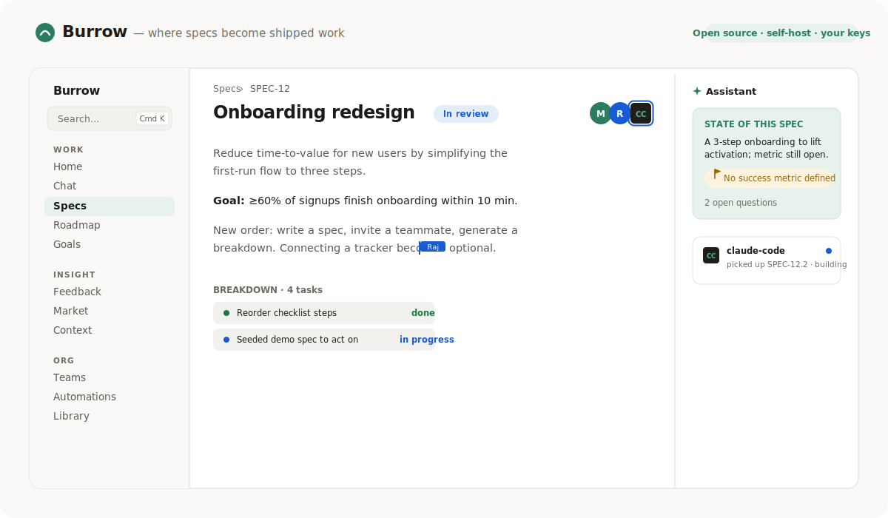
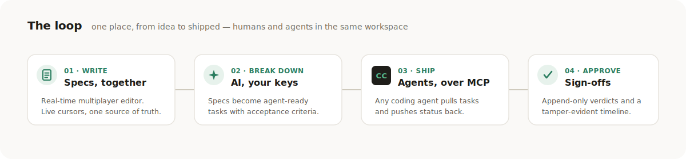
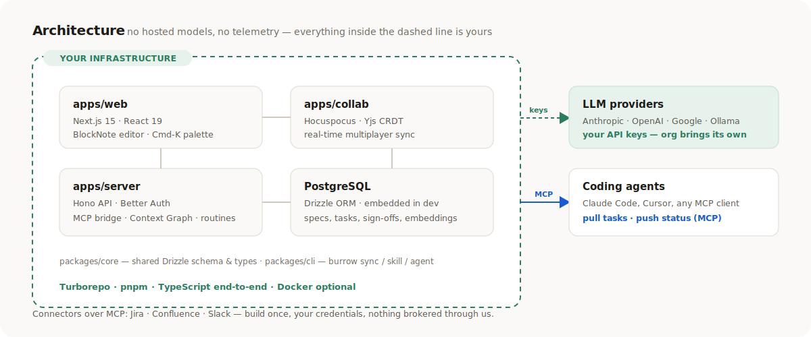

<div align="center">

# Burrow

### One surface for the whole product org. Specs to shipped.

**The open-source, self-hostable workspace for product teams and their AI agents.**
Write specs together in real time. AI breaks them into agent-ready work using *your own* API keys.
Any coding agent ships it over MCP — and nothing ever leaves your infrastructure.

<br/>

[](#-quickstart)
[](#-bring-your-own-keys)
[](#-connect-a-coding-agent-mcp)
[](#why-burrow)


<br/>



<br/>

[**Quickstart**](#-quickstart) · [**The loop**](#the-loop) · [**Features**](#-features) · [**Connect an agent**](#-connect-a-coding-agent-mcp) · [**Architecture**](#-architecture)

🌐 **Website:** [**Link here**](https://burrow.nirnaypatel.com) &nbsp;·&nbsp; ⭐ **Star the repo** if Burrow is useful to you.

</div>

---

## What is Burrow?

Burrow is one workspace for the whole product loop — **idea → spec → breakdown → shipped → signed off** — with humans and AI agents working side by side. It's a self-hostable alternative to closed, per-seat planning tools: you run it on your own box, plug in your own LLM keys, and your data never leaves.

Think of it as the **operating system for an AI-native product org**: real-time specs, AI that's grounded in *your* context, a roadmap and goals layer, customer-feedback and competitive-signal capture, and a first-class bridge so coding agents (Claude Code, Cursor, anything that speaks MCP) pull work and push status back automatically.

## The loop

<div align="center">

</div>

1. **Write** — Specs are multiplayer documents. Live cursors, merged edits, one source of truth.
2. **Break down** — AI turns a Spec into agent-ready tasks with acceptance criteria, grounded in your org's context.
3. **Ship** — Any MCP coding agent pulls the next task, does the work, and reports status back to the board.
4. **Approve** — Append-only sign-offs give you a tamper-evident record of who approved which version.

## Why Burrow

| | Burrow | Closed planning tools |
|---|---|---|
| **Where it runs** | Your infrastructure — `docker compose up` and it's yours | Their servers |
| **AI** | Bring your own keys (Anthropic, OpenAI, Google, OpenRouter, Ollama) | Hosted, metered, opaque |
| **Agents** | MCP-native — agents are first-class teammates in the activity feed | Bolted on, if at all |
| **Pricing** | Free, unlimited collaborators | Per creator, per month |
| **Your data** | Stays in your Postgres. No telemetry, ever. | Leaves your box |
| **Format** | Published `.burrow/` files — git is the version control | Closed, unpublished |

## ✨ Features

Burrow's navigation is grouped by intent — **Work**, **Insight**, and **Org** — and an AI layer runs through all of it.

#### 🛠 Work
- **Specs** — multiplayer rich-text editor (BlockNote + Yjs), a `/` slash menu for AI drafting *and* spec actions (`/breakdown`, `/signoff request`, `/link initiative`), a reviewer **reading mode**, an Assistant rail that surfaces gaps as calm offers, and a **post-launch evaluation panel** that streams an AI analysis against live analytics data (PostHog, Amplitude) once a spec is approved.
- **Roadmap** — initiatives across **Now / Next / Later**, drag-to-move, rolled-up spec progress.
- **Goals** — OKRs (and other frameworks) with key results and links to the specs/initiatives that serve them.
- **Chat** — a workspace assistant with read tools grounded in your specs and context.
- **Home** — a calm dashboard: what needs you, what agents are doing, and act-in-place approvals.

#### 🔭 Insight
- **Feedback** — capture customer signals; AI clusters them into themes and spins a theme into a Spec. Pull signals automatically via webhook from any source (n8n, Zapier, custom scripts) using ingest keys, or paste them in manually.
- **VoC Reports** — one click generates a streaming Voice-of-Customer report from your clustered themes: executive summary, verbatim quotes, gaps without a spec, and ranked recommendations.
- **Opportunity Ranking** — themes are scored automatically from feedback volume, sentiment, and market signal severity, then surfaced as ranked opportunities on the dashboard with AI-generated strategic narratives.
- **Market** — track competitors and severity-scored market signals with a "so what for us."
- **Context** — your company/product/persona docs, embedded into a Context Graph that grounds every AI surface.

#### 🏢 Org
- **Teams** — squads that own both people and work.
- **Connections** — MCP-first integrations (Jira, Confluence, Slack, PostHog, Amplitude) with your own credentials. Test any connection with one click.
- **Automations** — when/do routines (e.g. *sign-off approved → notify Slack*, *spec in progress → push Jira tasks*), no extra infra.
- **Library** — shareable, version-controlled **skills** and **agents** (and routines), synced as `.burrow/` files.

#### 🧠 AI-native & fast to operate
- Insights surfaced where decisions are made (roadmap, backlog, spec) — grounded in your Context Graph, **amber-never-red**, and silent when you haven't added a key.
- **⌘K command palette**, global search, single-key shortcuts (`/`, `C`, `G then S`…), and a `?` cheat sheet.
- Agents appear as square-avatar teammates in the live activity feed.

## 🏗 Architecture

<div align="center">

</div>

A **Turborepo + pnpm** monorepo, TypeScript end to end:

| Package | What |
|---|---|
| `apps/web` | Next.js 15 + React 19 UI — multiplayer editor, command palette, all surfaces |
| `apps/collab` | Hocuspocus + Yjs real-time server, Postgres-persisted |
| `apps/server` | Hono API — Better Auth, the MCP agent bridge, Context Graph, routines scheduler |
| `packages/core` | Drizzle schema + shared types |
| `packages/cli` | `burrow` — sync `.burrow/` files, push/pull skills & agents |

Embeddings run **app-side** on plain Postgres in dev (pgvector is the documented production swap). No Redis, no hosted models, **no Docker required for development**.

## 🚀 Quickstart

> **Prerequisites:** Node 20+ and `pnpm` (`corepack enable` gives you the pinned `pnpm@10.17.0`). No Docker needed for dev.

```bash
git clone <your-fork-url> burrow && cd burrow
pnpm install

pnpm dev:db        # embedded PostgreSQL 17 on :5433 — keep this running
pnpm db:push       # create the schema (new terminal)
pnpm dev           # web :3000 · server :8787 · collab :8788
```

Open **http://localhost:3000**, create an account, and write your first Spec. Open the same Spec in a second window to watch live cursors and merged edits.

> **AI features** light up once you add an org API key in **Settings** — until then, every AI surface degrades quietly (never an error, never empty chrome).

## 🌱 Seed realistic demo data

Want a fully-populated workspace to explore — teams, a roadmap, goals, feedback, market signals, routines, skills, and agents? Sign up a user, then:

```bash
cd apps/server
pnpm exec tsx scripts/seed-demo.ts      # Northwind org: specs, teams, initiatives, goals, feedback, market, routines, library
pnpm exec tsx scripts/seed-activity.ts  # a believable activity stream for the dashboard & feeds
```

This is the same data our end-to-end UAT runs against — see [`apps/server/scripts/UAT-RESULTS.md`](apps/server/scripts/UAT-RESULTS.md) (45/45 checks across every feature).

## 🔌 Connect a coding agent (MCP)

Burrow exposes an MCP server so any agent becomes a teammate. Grab your token from `http://localhost:8787/api/collab-token` (while signed in), then:

```bash
claude mcp add --transport http burrow http://localhost:8787/mcp \
  --header "Authorization: Bearer <token>"
```

The agent can now `list_specs`, `get_next_task` (dependency-aware, with spec prose), `update_task_status` (flows back to the board), `get_insights`, `list_skills` / `list_agents`, and more — every action shows up in the activity feed, attributed to the agent.

## 🔑 Bring your own keys

Burrow hosts **no models** and proxies **nothing**. Each org adds its own provider keys in Settings (Anthropic, OpenAI, Google, OpenRouter, or a local Ollama base URL). Keys are AES-256-GCM encrypted at rest and never leave your server. Pick the right model per task — pin a fast model to a triage agent, a stronger one to a reviewer.

## 🧰 The `burrow` CLI

Treat skills, agents, and routines as version-controlled files:

```bash
burrow skill pull            # fetch .burrow/skills/*.md
burrow agent push my-agent   # publish a local agent (409 on a conflicting edit)
burrow routine list          # see local vs remote drift
burrow sync                  # pull specs, context, and the authored subtrees
```

Authored subtrees (`skills/`, `agents/`, `routines/`) are committed to git; git *is* the version control.

## 📦 Project layout

```
burrow/
├── apps/
│   ├── web/         Next.js UI (all surfaces, ⌘K palette, multiplayer editor)
│   ├── collab/      Hocuspocus + Yjs real-time server
│   └── server/      Hono API · MCP bridge · Context Graph · routines
├── packages/
│   ├── core/        Drizzle schema + shared types
│   └── cli/         the `burrow` CLI
└── docs/            images + notes
```

## 🗺 Status

Burrow runs end to end today: multiplayer specs, AI breakdowns, the agent bridge, roadmap / goals / feedback / market / context, the Library (versioned skills & agents), insights everywhere, and a Linear-grade operability layer (palette, search, shortcuts).

Recent additions: webhook-based feedback ingestion with dedup and ingest key auth, VoC report generation via SSE streaming, opportunity ranking scored from feedback volume + sentiment + market signals, post-launch evaluation reports tied to analytics connections (PostHog, Amplitude), and connection probe/test for all integrations.

Hardening for managed deployment (Docker packaging, OAuth for MCP) is the next milestone.

## 📄 License

Open source. The license is being finalized (AGPL-3.0 vs Apache-2.0); see [`LICENSE`](LICENSE) once published.

<div align="center">
<br/>
<br/>
<sub>Built by <a href="https://nirnaypatel.com">Nirnay Patel</a></sub>
</div>
